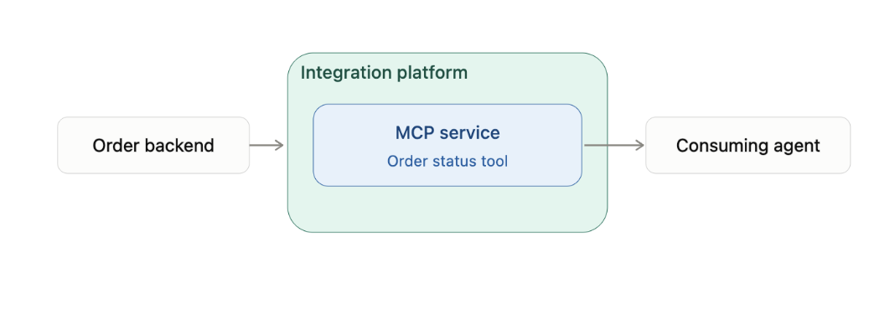
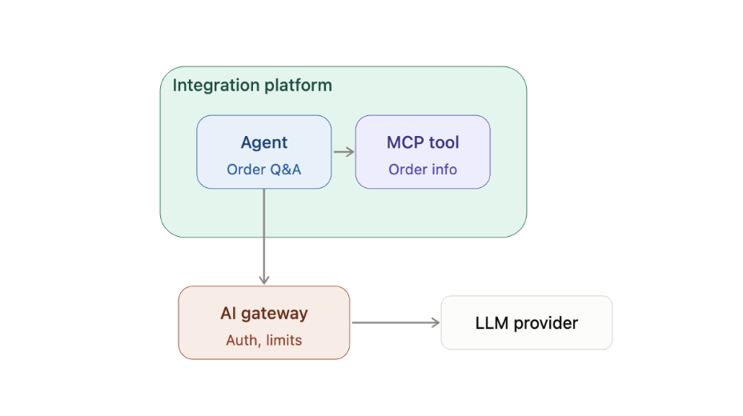
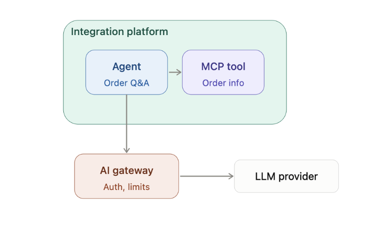
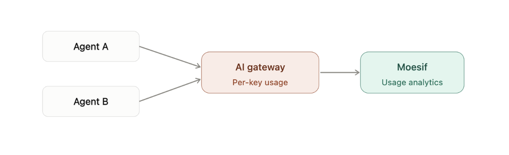
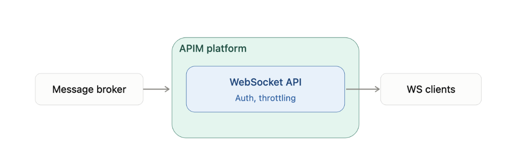
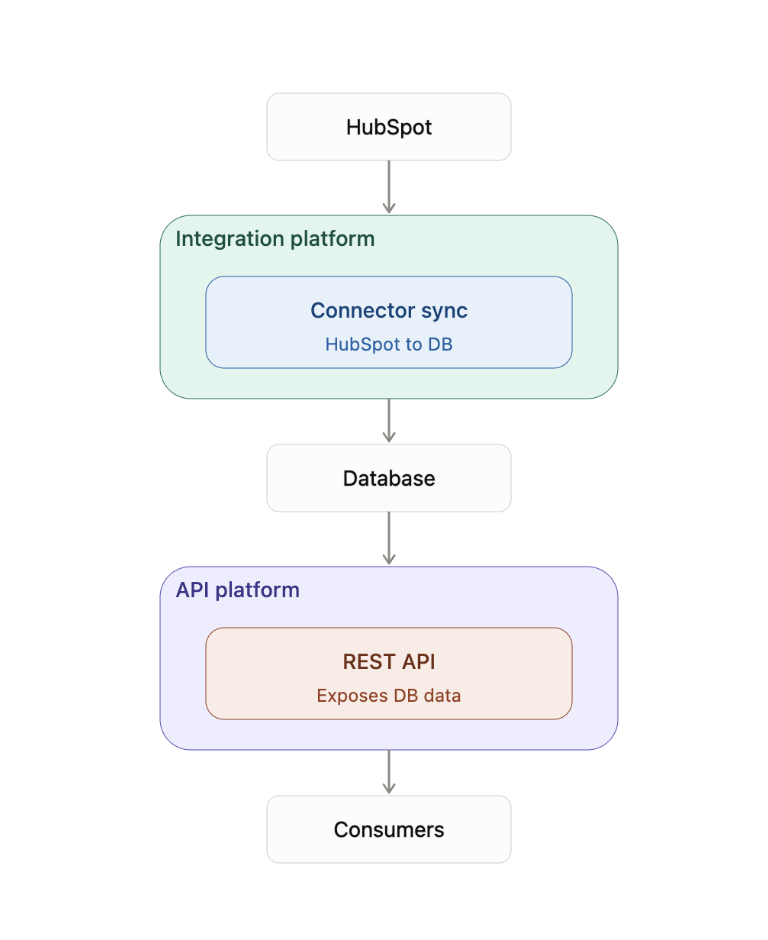
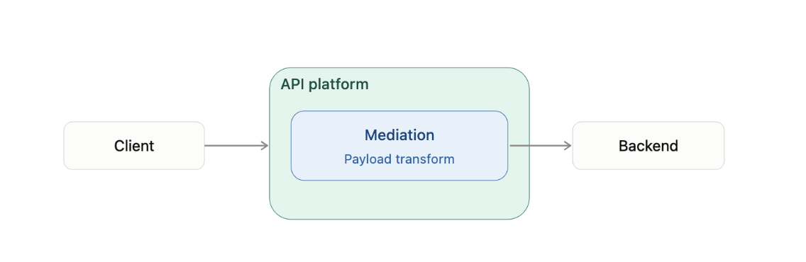

# C&S Wholesale — PoC Build Specification
Purpose: Define the scenarios to be built for the C&S Wholesale Proof of Concept, so the customer can run through them self-service. This document is the build reference for the team.

## 1. Objective
Stand up a dedicated PoC environment — provisioned infrastructure and accounts — that demonstrates the following capabilities to C&S Wholesale:

* Exposing order status via an MCP service, backed by the integration platform
* An AI agent that answers order-status queries using that MCP service
* Centralized governance of LLM traffic through an AI Gateway
* Observability into LLM token consumption, both overall and per application/agent
* Event-driven delivery of broker messages to external clients over WebSocket, with full API governance
* A connector-based integration pattern (HubSpot → database → API)
* Request mediation / payload transformation as a core integration capability

## 2. Infrastructure & Accounts to Provision
| Item | Notes |
|---|---|
| Dedicated C&S PoC tenant/accounts | Isolated from other PoC/demo environments |
| AI Gateway instance | Sits in front of the LLM provider(s) used by the agent |
| Integration platform instance| Hosts the MCP service and mediation flows |
| API Gateway/APIM instance| Fronts the WebSocket API and REST APIs |
| Message broker| Kafka/JMS/RabbitMQ — existing or stood up for the PoC |
| Database| Target store for HubSpot-synced data |
| HubSpot developer/sandbox account| Source system for the connector story |
| LLM provider access/keys| Routed exclusively through the AI Gateway |
| Analytics/observability access| For token-usage dashboards, shared with customer |
| Customer-facing access (read-only or scoped)| So C&S can run scenarios themselves |

## 3. Scenarios

### 3.1 MCP Service — Order Status (Integration Platform)

Problem: Order status lives in backend systems with no standard, agent-consumable interface.

Solution: Build an MCP (Model Context Protocol) service on the integration platform that exposes an order status tool, backed by the existing order data source(s).

Flow: Backend order system → Integration platform (MCP service) → MCP tool (getOrderStatus) → Agent/consumer.

Build tasks:
* Identify backend order-status data source (API, DB, or file)
* Build integration flow to fetch/normalize order status
* Expose as an MCP tool with a clear schema (order ID in, status/ETA out)
* Secure the MCP endpoint (auth, throttling)

### 3.2 Agent — Order Status Q&A
Problem: Customers/CSRs want to ask order-status questions in natural language rather than looking up order IDs manually.

Solution: An AI agent that takes a natural-language question, calls the MCP service (3.1) as a tool, and returns a natural-language answer.

Flow: User query → Agent → MCP tool call (order status) → LLM formats response → User.

Build tasks:
* Define agent prompt/instructions and tool-calling behavior
* Wire agent to the MCP service from 3.1
* Basic conversational handling (missing order ID, order not found, etc.)

### 3.3 LLM Proxied Through AI Gateway
Problem: Direct LLM calls from the agent bypass governance — no centralized auth, rate limiting, cost control, or visibility.

Solution: Route all LLM calls (from the agent in 3.2) through an AI Gateway rather than calling the LLM provider directly.

Flow: Agent → AI Gateway → LLM provider → AI Gateway → Agent.

Build tasks:
* Provision AI Gateway in front of the chosen LLM provider(s)
* Point the agent's LLM calls at the gateway endpoint
* Apply auth, rate limiting/throttling policies at the gateway

### 3.4 LLM Analytics — Token Usage

Problem: No visibility into LLM consumption/cost.

Solution: Use the AI Gateway's analytics to report total token usage (prompt + completion) across all LLM traffic.

Build tasks:
* Enable analytics on the AI Gateway
* Build/expose a token-usage view (dashboard or report) covering the PoC period

### 3.5 Token Usage Per Application / Agent

Problem: Aggregate token usage doesn't show which application or agent is driving cost/consumption.

Solution: Break down token usage by application/agent identity, using per-consumer keys or labels enforced at the AI Gateway.

Build tasks:
* Ensure each calling application/agent authenticates with a distinct identity/key at the gateway
* Configure analytics to segment token usage by that identity
* Present as a per-application/agent breakdown alongside the aggregate view (3.4)

### 3.6 Broker-to-WebSocket Gateway Pattern

Problem: The internal message broker (Kafka/JMS/RabbitMQ) speaks a protocol that external/web clients can't consume directly, and raw broker access has no auth, throttling, or governance.

Solution: Front the broker with a WebSocket API on an API Gateway (e.g., WSO2 APIM). The gateway subscribes to the broker topic and pushes messages to connected WebSocket clients in real time, applying the same governance as REST APIs.

Flow: Producer → Broker topic → Gateway (WS subscriber) → Authenticated WS clients (web/mobile/partner apps) — pushed instantly, no polling.

Benefits:
* Decouples consumers from broker protocol/vendor
* Centralized security and throttling
* Self-service via developer portal (AsyncAPI docs)
* Real-time delivery, no polling

Build tasks:
* Identify the broker topic to expose (likely order-status events, to tie into 3.1)
* Configure gateway as a broker subscriber
* Expose as a governed WebSocket API with OAuth2/JWT auth
* Publish AsyncAPI docs to the developer portal

### 3.7 Connector Story — HubSpot Sync + API

Problem: C&S needs a repeatable pattern for pulling data from a SaaS system (HubSpot) into their own data layer, then exposing it internally/externally.

Solution: Use a HubSpot connector on the integration platform to sync data into a database, then expose that data as an API.

Flow: HubSpot → Connector (scheduled/event-driven sync) → Database → Integration platform → REST API → Consumers.

Build tasks:
* Configure HubSpot connector (choose object(s) to sync — e.g., contacts/deals)
* Define target database schema
* Build the sync flow (polling or webhook-driven)
* Expose synced data as a REST API with appropriate auth

### 3.8 Request Mediation — Payload Conversion

Problem: Upstream and downstream systems don't share a common payload format/schema.

Solution: Use the integration platform's mediation capability to transform requests/responses between formats (e.g., XML ↔ JSON, or schema-to-schema mapping) as they pass through. Or preferably, GraphQL-to-REST conversion if time permits. 

Flow: Client → API/Integration endpoint → Mediation (payload transform) → Backend system (and reverse on the response path).

Build tasks:
* Pick a representative payload transformation to demo (tie to one of the other scenarios where possible, e.g. order status backend format → agent-friendly JSON)
* Build the mediation flow
* Validate both request and response transformation paths

## 4. Suggested Build Sequence

1. Integration platform + MCP service (3.1)
2. AI Gateway provisioning + LLM proxying (3.3)
3. Agent build, wired to MCP + AI Gateway (3.2)
4. Analytics: aggregate and per-app/agent token usage (3.4, 3.5)
5. Broker-to-WebSocket pattern (3.6)
6. HubSpot connector story (3.7)
7. Request mediation demo (3.8)

## 5. Deliverable for Customer

* Self-service access to each scenario (scoped credentials/URLs)
* Short walkthrough guide per scenario (what it demonstrates, how to run it)
* Documents which contains all the information about what we built. 
* Token-usage dashboards visible to the customer

